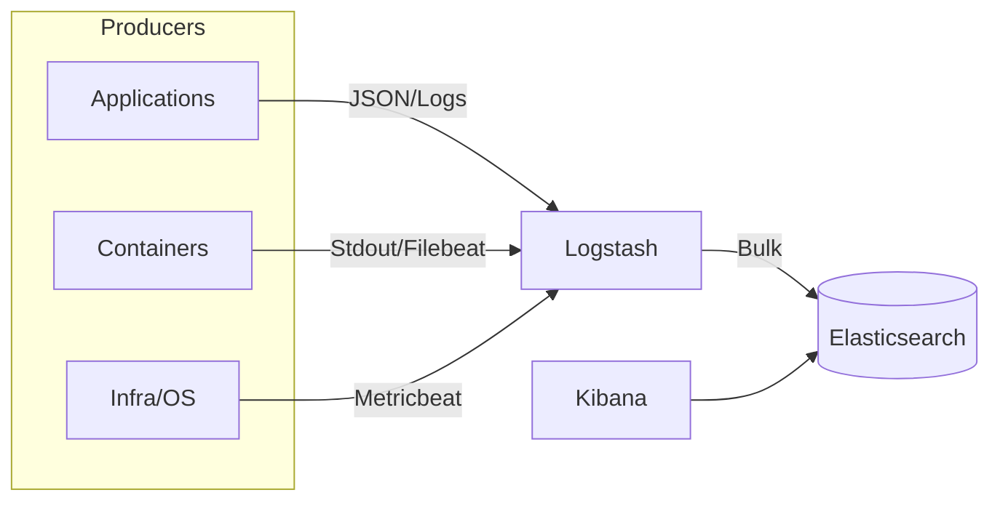

# ELK Stack (Elasticsearch, Logstash, Kibana)

Production-ready, developer-friendly ELK stack template for logs, metrics, and traces. This repository provides a clean starting point to run and customize Elasticsearch, Logstash, and Kibana locally or in lower environments using Docker and Kubernetes.

> Tip: 

---

## Overview

The Elastic Stack (ELK) is a set of tools for ingesting, storing, searching, analyzing, and visualizing data in real time:

- Elasticsearch: Distributed search and analytics engine
- Logstash: Ingest, transform, and route data
- Kibana: Visualization and management UI

This repo is intended for local development and PoCs. For production, review the official architecture guidance and harden security, scaling, and reliability accordingly.

---

## Architecture

---

## Requirements

- macOS, Linux, or Windows (with Docker Desktop)

---

## Quick Start 

---
## Project Structure

---

## Contributing

Contributions are welcome. Please open an issue to discuss changes before submitting a PR. Follow conventional commit messages and include context for configuration updates.

---

## License

This project is licensed under the MIT License. See `LICENSE` for details. Update this section to your actual license.

---

## References

- Elastic Docs: https://www.elastic.co/guide/
- Elasticsearch Docker: https://www.elastic.co/guide/en/elasticsearch/reference/current/docker.html
- Logstash: https://www.elastic.co/guide/en/logstash/current/index.html
- Kibana: https://www.elastic.co/guide/en/kibana/current/index.html
- Beats: https://www.elastic.co/guide/en/beats/libbeat/current/index.html

---

## FAQ

Q: Is this production-ready?
A: It’s a solid local/dev baseline. For production, enable TLS, role-based access, backups, monitoring, and consider multi-node ES with hot/warm tiers.
